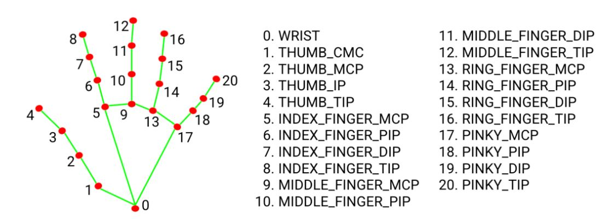

## Explanation

This program captures video from your webcam frame by frame. Each frame, which is a NumPy array, is passed to the findHands function within the handDetector class. This function utilizes a MediaPipe model to accurately locate the 21 keypoints of the hand's knuckles within the detected hand regions.



When this joints have correctly identified,marked and connected using lines, next thing to do is to identify the fingertips and check whether those tips are opened or closed which can be implemented using a simple if else condition.


```python
  tip_ids=[4, 8, 12, 16, 20 ]
```
+ tips_ids list store the index of tip points of thumb, index, middele, ring, pinky fingers.

```python
  #for thumb up checking
  if landList[tip_ids[0]][2:] > landList[tip_ids[0]-1][2:]:
      fingers.append(1)
  else:
      fingers.append(0)
  #for remaining fingers up checking
  for i in range(1,5):
      if landList[tip_ids[i]][2:] < landList[tip_ids[i]-2][2:]:
          fingers.append(1)
      else:
          fingers.append(0)
  
  total_fingers_up=fingers.count(1)    
```

+ The first if-else is for detecting whether tip of thumb is opened or closed.
+ The second if-else is for other fingers such as index, middle, ring, pinky to check whether tip is opened or closes.
  
    + The main idea is to compare the coordinates(x,y) of the 21 identified points to reach desired condition.
        here, (x1,y1) of any finger tip is compared with its corresponding PIP(proximal interphalangeal) joint(x2,y2) to determine if the finger is up or down except thumb.
    + For thumb we compare tip point with thumb_ip(Interphalangeal) joint to check if thumb is down or up.
    + If a point is down then zero is appended to a list named fingers.
    + so fingers for a frame will have n number of 1's for nfingers up and j number of 0's for jfingers down.
    + finally we use count function on fingers which will return the numbers of ones in list which will indicate the number of fingers up.

+ We then use this count to display the number and images accordingly.

>[!TIP]
>Remember that all process or calculations that we do is done frame by frame, not all at once.


